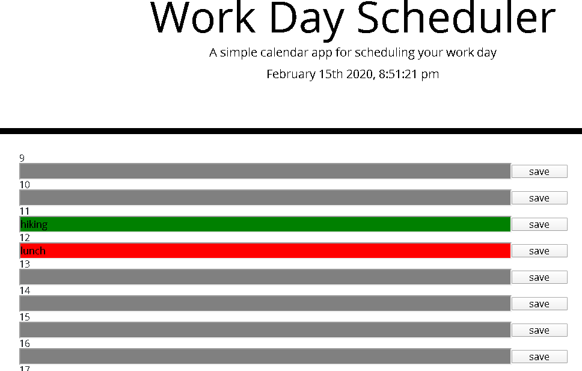

# Workdayscheduler
When you have a busy day, a scheduler can be a great tool for helping you manage your time in a better way. 
if you work at a front desk it is very inportant to know who will come in and out of the business and at what time. A scheduler will manage all that information for you.

## Instructions
Next to the time of day, place your input and then save the information. You can make your schedule for weeks ahead and come back to make any changes or just look at the day ahead and prepare for it with the help of the scheduler.

### updates 
new futures will come soon 

https://shift4change.github.io/WorkDayScheduler/

